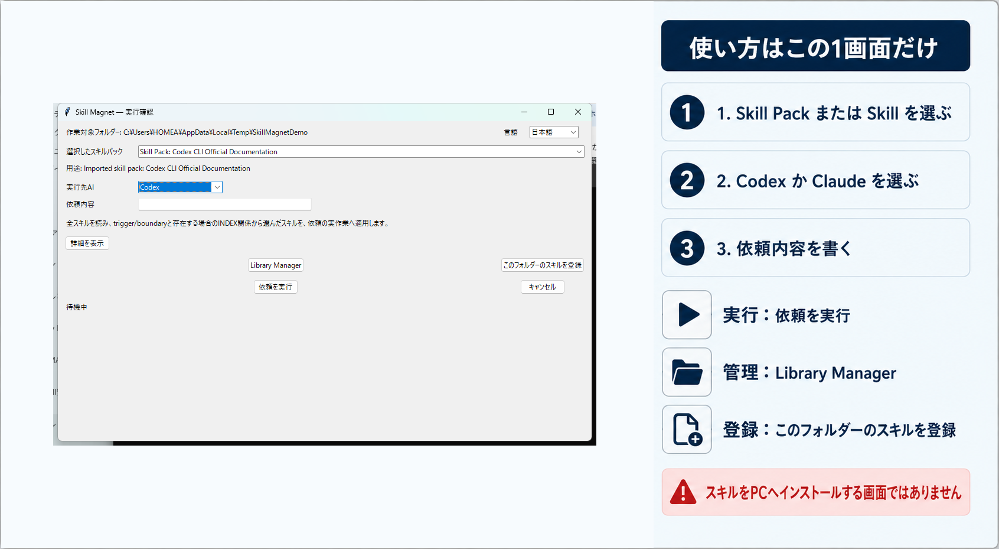

# Skill Magnet

Skill Magnetは、GitHubをスキルの保管庫として利用し、必要なスキルパックを選んでCodex DesktopアプリまたはClaude Codeデスクトップアプリへ安全に受け渡すローカルツールです。

## 目的

Skill Magnetの目的は、GitHub固定commitに保管されたskillをLLMへ単に読ませることではなく、利用者の実際の依頼へ正確に適用させ、完成した成果を得ることです。LLMは選択packの全skillを読んでtrigger/boundaryから必要最小集合を選び、選んだskillの手順・判断基準・境界を実際の分析、編集、生成、検証へ反映します。読了、要約、候補列挙、実行可否の説明だけでは完了ではありません。packにINDEXが存在する場合だけ、その関係も読んで `depends-on` / `composes-with` / `contrasts-with` を適用します。成果形式は実際の依頼とskillに従い、自然文、JSON、コード、ファイルなどをSkill Magnetが一律に禁止しません。

## 現在の状態

今回の出荷対象はWindows版MVPです。右クリック起動、スキル登録・更新・削除、Codex Desktopアプリ／Claude Codeデスクトップアプリへの受け渡し、途中失敗からの復旧を受入対象とします。macOS対応は維持しますが、このMVPの合格をmacOSを含む全製品完成とは扱いません。出荷範囲は `policy/product-policy.json` の `release_profiles.windows_mvp`、実行方針は [MVP製品化指示書](docs/mvp-shortest-productization-plan-2026-09-06.md) に定めます。出荷対象の定義は、公開済みという意味ではありません。

GitHub中心の手動activation経路は、スキルパックを一つ選ぶUXです。通常右クリックの正規入口は、子メニューを持たない `Skill Magnet` 一つです。これを押して開く共通画面で対象パックを選び、Codex DesktopアプリまたはClaude Codeデスクトップアプリと依頼内容を明示します。Codexを選ぶとCodex Desktopの新規taskへ、Claudeを選ぶとClaude Desktop内の新規Claude Code sessionへ、パック内の全スキルと依頼が渡されます。CLI/TUIやWebブラウザは製品handoff先にしません。skill contentの永続的な正本は該当するユーザー所有GitHub repositoryだけで、Skill Magnetは固定commitをメモリ上で検証します。promptには固定commitの全SKILL.md URLとdigestを渡し、INDEXが存在するpackではINDEXのURLとdigestも渡します。library編集時だけ製品所有の隔離workspaceを使い、実行用にはmaterializeせず、有効化完了後に削除します。両デスクトップアプリには全skillの読了、trigger/boundaryと存在する場合のINDEX関係に基づく必要最小集合の選定、最低1つの具体的適用、実依頼の完了を必須化します。skillの説明・一覧・準備確認だけで終了することを禁止します。Skill MagnetはAPI keyや従量課金APIを使わず、既存のCodex DesktopまたはClaude利用プランへhandoffします。handoff受理は回答完了を意味せず、Skill MagnetはLLM回答を取得・検証したとは主張しません。Windows ExplorerとmacOS Finderは規範policy上のsupported adapterです。

旧MVPの `sync` は `~/.agents/skills` と `~/.claude/skills` への常設コピーを前提とし、現在の製品ポリシーに適合しません。CLIから恒久的に無効化しており、overrideはありません。

## 製品ポリシー

唯一の規範的な定義は [`policy/product-policy.json`](policy/product-policy.json) です。以下は、その `principles_ja` を読みやすく表示したものです。文書と定義の不一致は自動テストで拒否します。

<!-- product-policy:begin -->
- GitHubのユーザー所有保管庫を唯一の正本とする。
- Skill Magnetはスキルの目的に沿って、必要なパックだけを明示選択して呼び出す。
- Codex Desktopアプリ／Claude Codeデスクトップアプリへの全件・常設・暗黙同期を既定にしない。
- skillの永続保管は該当するユーザー所有GitHub repositoryだけとする。明示したlibrary編集transaction中だけ製品所有の隔離workspaceへ一時複製できるが、実行用materializeには使わず完了後に削除する。
- 保管庫の版・来歴・承認を保持する。
- ローカル配置の成功を、スキルの読み込み成功または使用成功とみなさない。
- 選択したpackとversionをタスクへ明示し、全skillの読了、最低1つの実作業への適用、存在する場合だけINDEX関係の適用をpromptで必須にする。読了や要約だけを実行完了とみなさない。
- Codex Desktop／Claudeの既存利用プランを使い、API key、従量課金API、追加支払いを製品経路で要求しない。
- 公式に確認できる経路または必要な証拠がない場合はfail-closedで停止し、保証外であることを明示する。
- 通常のskill実行はユーザーの右クリックメニューからの明示選択を条件とし、自動提案・自動配布・自動有効化をしない。Library Managerでは、利用者が明示した登録・更新・削除だけを同じ復旧可能transactionで自動公開・検証・反映できる。
- Windows ExplorerとmacOS Finderで同じ選択・確認・起動の意味と安全ポリシーを提供する。
<!-- product-policy:end -->

このポリシーから、次の既定動作が決まります。

- 起動時に有効なパックはゼロです。
- ユーザーは必要な時にアプリでパックと対象ランタイムを明示選択します。自動提案、自動配布、自動有効化はしません。
- GitHub URL、完全なcommit SHA、承認記録を検証してから有効化します。
- GitHubから取得したskill bytesはprocess memory内だけで検証し、ローカルへ展開・保存しません。
- 全パックの一括配布、ユーザー領域への常設配置、バックグラウンドでの暗黙同期は既定機能にしません。
- ファイルのclone、展開、配置、候補表示だけでは「スキル使用成功」と表示しません。

## 想定する利用手順

現行MVPは、以下の確定済みCLIと右クリック統合でこの流れを実装しています。

1. ユーザー所有GitHub保管庫から利用可能なパックと、その目的・版・承認状態を一覧する。
2. 必要な時にユーザーが右クリックの`Skill Magnet`から共通画面を開き、その画面で目的に合うスキルパックとCodex DesktopアプリまたはClaude Codeデスクトップアプリを明示選択する。
3. GitHub固定commit、対象、承認、全skillと任意のINDEXをメモリ内で検証する。
4. 選択したpack ID、GitHub URL、commit SHA、全skill ID、instruction digestをタスクへ明示注入する。
5. 選択したデスクトップアプリで新規taskまたは新規Claude Code sessionを開き、全skillの読了と最低1つの適用を必須とする一つのpromptを渡す。
6. 利用者は選択したデスクトップアプリで自然文回答を確認する。Skill Magnetはhandoff成功と回答完了を混同しない。

通常のフォルダーを右クリックした場合、そのフォルダーはスキルのインストール先ではなく、依頼を実行して成果物を置くための「作業対象フォルダー」としてデスクトップアプリへ渡します。`~/.codex/skills`、`~/.agents/skills`、`~/.claude/skills`とその配下を右クリックした場合は、skillを選ぶ正当な操作として受け付けますが、その領域を作業対象にはしません。利用者へ別フォルダーの選択を要求せず、`path`／`folder`を付けないprojectlessの新規タスクへ自動変換してhandoffします。Skill Magnetはskill領域へコピー、インストール、成果物保存を行いません。

`dry-run` を通していない有効化は拒否する設計です。

## Library Manager

Library Managerは、登録済みのパックとスキルを一覧し、新規登録・更新・削除してユーザー所有GitHub repositoryへ公開し、Skill Magnetで参照できる状態にするための管理画面です。skillをCodex／Claudeのskill directoryへインストールする機能ではありません。作業途中のファイルはアプリ専用領域へ自動保存されます。利用者が作業用フォルダーやrepository名、内部IDを入力する必要はありません。

管理画面を開くたびに、設定済みGitHubの検証済みcommit（未設定時は取得したHEAD）から編集用コピーを作ります。skill本文を含むコピーを残すのは未完了transactionの復旧中だけです。成功、送信前の明示破棄、変更のない通常終了では削除し、次回はGitHubから読み直します。状態保存先に`~/.codex/skills`、`~/.agents/skills`、`~/.claude/skills`またはその配下は指定できません。

旧版の固定pathに残った、双方向の所有証明がないlibraryは、内容やGit remoteが一致していても自動所有化・自動編集・自動削除しません。同じ場所へ利用者が置いた手動cloneと区別できないためです。`GitHubから復旧`を明示した場合だけ、元フォルダーを別名バックアップとして保持したうえで検証済みコピーを作ります。マージされず閉じたPRは監視を停止し、同じPRを再度開いて同じtransactionを続行できます。

Windows Explorerでは登録元フォルダーを右クリックして`Skill Magnet`を押し、開いた1画面の`このフォルダーのスキルを登録`を選びます。選択したフォルダーがそのまま検証・登録されるため、アプリ内でもう一度選び直す必要はありません。同じ画面の`Library Manager`は登録済みスキルの一覧・更新・削除・GitHub公開に使います。単一スキル、1パック、複数パックを含む親フォルダーのいずれも登録できます。macOS Finderでも選択フォルダーをクイックアクションへ渡します。

### 操作ガイド（1画面）

登録元に `SKILL.md` がない場合は、ライブラリの復旧やGitHub読込より先に原因と選び直し方法を表示します。設定済みのGitHub URLは表示したまま、登録元・既存ライブラリへの書き込みは行いません。



右クリック後に開く画面は1つです。使う`Skill Pack`または`Skill`、実行先のCodex／Claude、依頼内容を順に指定します。依頼を渡すときは`依頼を実行`、登録済みスキルを管理するときは`Library Manager`、右クリックしたフォルダーを新しく登録するときは`このフォルダーのスキルを登録`を押します。この画面はスキルをPCへインストールする画面ではありません。

#### 1. 登録済みのパックとスキルを確認する

画面上部にはパックを親、スキルを子として登録内容を表示します。表示名、種類、内部ID、説明を確認できます。内部IDは照合用の表示であり、入力する項目ではありません。同じスキル集合を持つ別名パックは新規登録時に重複として停止します。

#### 2. 新規登録・更新・削除する

`新規登録`では作成済みのフォルダーを1つ選びます。スキルフォルダーなら1スキル、直下に複数のスキルフォルダーがあれば1パック、直下に複数のパックフォルダーがあれば全パックを検出します。Skill ID、Pack ID、表示名、目的はフォルダー名、`SKILL.md`、`INDEX.md`から自動取得します。

`選択項目を更新`では一覧でパックまたはスキルを選び、同じIDの更新元フォルダーを選びます。IDが異なるフォルダーは別物への誤更新として拒否します。`選択項目を削除`では一覧の対象を削除します。依存されているスキルと最後のパック／スキルは削除できません。登録・更新・削除の操作自体を、その変更だけをGitHubへ公開してSkill Magnetへ反映する明示承認として扱います。検証、専用branchへのpush、PR、自動マージ、remote照合、本体反映を一つのtransactionで進め、途中失敗時は保存済みjournalから再開します。

登録元で必須なのは、各スキルの`SKILL.md`と、そのfrontmatterにある`name`／`description`です。`Trigger`／`Boundary`という見出しや固定の日本語表現は必須ではなく、それらの単語がない標準Skillも登録できます。`acceptance.json`がない場合は、Library Managerが公開用の内部互換メタデータを生成します。同じフォルダーに`test-prompts.json`があれば、そのSHA-256も記録します。同じ内容の登録済みスキル／パックをもう一度選んだ場合は正常な再選択として扱い、上書きせず`登録済み`と表示します。空フォルダー、INDEXが参照するスキルの欠落、重複ID、壊れた関係、登録情報と保存ファイルの不一致は登録前にエラーで停止し、一部だけを登録しません。

例: `C:\Projects\cangjie-skill-clean\books`を指定すると、直下の`codex-cli`、`conflict-clarity`、`harness-bootstrap-prompt-v2-1`を3パックとして一括登録します。確認済みの構成では合計33スキルです。

#### 3. 同じ画面でGitHubへ送る

現在使っているスキル保管庫が1つなら、そのGitHub URLを既存設定から自動表示します。初回または別の保管庫へ変える時だけURLを入力します。右クリックの`このフォルダーのスキルを登録`、または画面内の登録・更新・削除を実行すると、検査、専用branchへのpush、PR作成、自動マージ、merge commit検証、本体設定更新までを続けて実行します。packやskillの内容変更だけでは、単一の右クリックメニューを再登録しません。追加の段階ボタンはありません。GitHubの必須check待ちは同じtransactionで自動監視し、アプリを閉じても次回起動時に再開します。不足や不正があればGitHubへ送信する前に停止します。差分が0件ならPRを作らず、検証済みremoteをそのまま反映します。反映失敗時は直前の正常な設定へ戻します。

途中でGit、Windows、通信などのエラーが起きた場合は、同じtransactionを保存して再試行できます。commit／push／PRというGitHub側の副作用がないと確認できる段階だけ「ローカル作業を破棄」を選べます。送信済み、または送信済みか不明な段階では破棄を禁止し、remote状態を照合して既存branch／PRを再利用します。アプリを閉じても、次回起動時に未完了作業を検出し、新しいtransactionやPRを作らず続きから再開します。公開処理は管理対象ファイルだけを上書きし、GitHubに元からあるREADME、監査資料、テスト資料などを削除しません。削除差分が1件でも検出された場合は送信前に停止します。

右クリックから起動すると、先にLibrary Manager本体と「受付完了」を表示し、設定読取、保存済み作業の復旧、folder検査、登録をbackgroundで進めます。処理中の内容を画面上部へ表示し、入力欄と操作ボタンを無効化します。統合画面からLibrary Managerへ切り替わる際は単一実行lockの画面情報も新しいwindowへ引き継ぎます。同じフォルダーを続けて右クリックした場合は生存中のLibrary Managerを前面に戻して二重登録せず、別フォルダーの並行投入は既存処理を保持したまま再試行方法を表示します。アプリが強制終了してもOSの実行ロックは自動解放されるため、次回起動で利用者自身が再試行できます。

CLIから直接開く次のcommandも、障害調査やheadless運用の入口として残しています。以下のauthoring commandが扱うrepositoryはGitHub公開transactionの編集用入力であり、Codex／Claudeへskillをローカルインストールする経路ではありません。永続正本として有効になるのはremote bytesを再検証したGitHub固定commitだけです。

```powershell
python -m skill_magnet library ui
```

```powershell
# 1. CLIでスキル保管庫を作る
python -m skill_magnet library init --repository C:\path\to\skill-magnet-skills

# 2. skillを追加する（--sourceで既存SKILL.md/acceptance.jsonもimport可能）
python -m skill_magnet library add --repository C:\path\to\skill-magnet-skills --skill-id my-skill --display-name "My skill" --purpose "実行目的" --pack-id my-pack

# 3. fail-closed検証
python -m skill_magnet library validate --repository C:\path\to\skill-magnet-skills

# 登録済みpack／skillを一覧する
python -m skill_magnet library list --repository C:\path\to\skill-magnet-skills

# 選択IDと同じフォルダー内容で更新する
python -m skill_magnet library update --repository C:\path\to\skill-magnet-skills --kind skill --id my-skill --source C:\path\to\my-skill

# 明示確認して削除する（--kind packも指定可能）
python -m skill_magnet library delete --repository C:\path\to\skill-magnet-skills --kind skill --id my-skill --confirm

# 4. 隔離workspaceで差分previewを作る。出力されたtransaction_idを以後使う
python -m skill_magnet library prepare --library C:\path\to\skill-magnet-skills --remote https://github.com/OWNER/skill-magnet-skills.git

# 5. 明示確認後、専用branchへnon-force pushしてPRを作る
python -m skill_magnet library publish --transaction-id TRANSACTION_ID --confirm

# 6. PR merge後にremote bytesを再確認し、検証済み状態へ進める
python -m skill_magnet library verify-merged --transaction-id TRANSACTION_ID

# 7. 本体configへatomicに反映しreceiptを保存する
python -m skill_magnet library activate --transaction-id TRANSACTION_ID --confirm

# 状態一覧
python -m skill_magnet library status

# GUIを開けない場合も、同じtransactionを復旧できる
python -m skill_magnet library recover --transaction-id TRANSACTION_ID

# GitHubへ未送信のローカル作業だけを破棄する
python -m skill_magnet library abandon --transaction-id TRANSACTION_ID --confirm
```

GUIでは登録・更新・削除の操作自体を、その変更についてのGitHub公開・自動マージ・反映承認として扱います。CLIの個別`publish`と`activate`は引き続き確認なしでは動きません。default branchへの直接pushは、`prepare --branch <default-branch>`と`publish --direct --no-pr --confirm`を両方明示し、repository policyがpushを許可した場合だけ成立します。PR未merge、remote digest不一致、secret候補、symlink、path traversal、dependency cycle、同一pack内のcontrastは有効化されません。GitHub tokenを引数、config、journal、receiptへ保存しません。

関連文書:

- [Library Manager自動公開・反映 実装計画](docs/library-manager-automatic-sync-plan-2026-09-03.md)
- [Library Manager自動公開・反映 実装報告](docs/library-manager-automatic-sync-report-2026-09-03.md)
- [CMA004 Markdown出力への訂正・対応報告](docs/cma004-markdown-output-correction-2026-09-03.md)
- [標準Skill登録拒否の原因調査](docs/root-cause-standard-skill-rejection-2026-09-03.md) / [対応報告](docs/standard-skill-validation-fix-report-2026-09-03.md)

- [Library Manager要件定義](docs/skill-library-management-requirements.md)
- [Skill CRUDユーザーニーズ](docs/skill-crud-user-needs.md)
- [Skill CRUD修正方針](docs/skill-crud-remediation-policy.md)
- [Skill CRUD実行方針](docs/skill-crud-execution-plan.md)
- [Skill CRUD実装報告](docs/skill-crud-implementation-report-2026-09-03.md)
- [0.5.6スキル登録スモークテスト](docs/skill-registration-smoke-test-2026-09-03.md)
- [`&#x20;`再発の原因調査](docs/root-cause-u0020-recurrence-2026-09-03.md) / [対応報告](docs/fix-report-u0020-recurrence-2026-09-03.md)
- [0.5.5リリース報告](docs/release-0.5.5.md)
- [0.5.4リリース報告](docs/release-0.5.4.md)
- [実装計画](docs/skill-library-manager-implementation-plan-2026-09-02.md)
- [実装報告](docs/skill-library-manager-implementation-report-2026-09-02.md)
- [スモークテスト結果](docs/skill-library-manager-smoke-test-2026-09-02.md)
- [Windowsアクセス拒否の原因調査](docs/root-cause-library-manager-winerror5-2026-09-03.md)
- [中断復旧の実装・対応報告](docs/library-manager-recovery-implementation-report-2026-09-03.md)
- [Claude Codeデスクトップアプリ handoff対応報告](docs/claude-code-desktop-handoff-report-2026-09-02.md)
- [skill repository契約](docs/skill-repository-contract.md)

## Windows 11 Quick Start

前提はWindows 11、Python 3.12以降、Visual Studio Build Tools（Desktop development with C++）、Windows 10/11 SDKです。以下はPowerShellで実行します。

1. PowerShellを開き、Skill Magnetのrepository rootへ移動します。

   ```powershell
   git clone --recurse-submodules https://github.com/omusubiman5/skill-magnet.git
   cd skill-magnet
   ```

2. このrepositoryのSkill MagnetをPythonへ登録します。

   ```powershell
   python -m pip wheel . --no-deps --wheel-dir .\dist
   python -m pip install --force-reinstall .\dist\skill_magnet-0.5.9-py3-none-any.whl
   ```

3. Windowsの右クリックメニューを登録します。このcommandはrepository rootで、そのままcopy/pasteできます。

   ```powershell
   python -m skill_magnet install-context-menu --platform windows --confirm
   ```

4. Windowsの確認画面が出た場合は、次節の表と一致するときだけ「はい」を選びます。commandが完了すると、登録結果がJSONで表示されます。

5. Explorerで対象folderそのもの、またはfolder内の何もない場所を通常右クリックします。`その他のオプションを表示`へ進まず、最初のメニューにある`Skill Magnet`を押します。右クリックメニュー内に二段目の子項目はありません。

6. 開いた1画面で、使用する`Skill Pack: <表示名>`または`Skill: <表示名>`とCodex／Claude、依頼内容を選びます。スキルを管理する場合は同じ画面の`Library Manager`、右クリックしたフォルダーを登録する場合は`このフォルダーのスキルを登録`を押します。CodexならDesktop appの新規taskが開きます。技術情報は既定で閉じた「詳細」にあります。

メニューを登録しただけではskillやAIを自動実行しません。画面で依頼内容を入力して確認するまで処理は始まりません。

### Windowsの確認画面が出たら

画面には「このアプリがデバイスに変更を加えることを許可しますか？」に相当する文言が表示されます。これはWindows 11の通常右クリックメニューを登録するための確認です。初回導入、modernメニューの再登録・復旧、または削除時の後片付けで必要になる場合があります。Skill Magnetを右クリックから使うたびに出るものではありません。

| 「はい」を押してよい | 「いいえ」を押して停止する |
|---|---|
| 直前に自分で、このREADMEのinstall、rollback、uninstall commandのいずれかを実行した | commandを実行していないのに突然表示された |
| 表示された対象がWindowsの機能で、発行元がMicrosoft WindowsまたはMicrosoft Corporationとして確認できる | 発行元が不明、別会社、または表示内容がREADMEと異なる |
| Skill Magnetの右クリックメニューを登録、復旧、削除しようとしている | 通常のskill実行中に毎回表示された |
| Windowsのaccount policyに従う管理者確認である | Codex/Claudeのpassword、API key、支払い、browser loginを求められた |

この確認はCodex/Claudeの認証、機密入力、外部送信、課金を許可するものではありません。想定外なら拒否し、繰り返し実行せず「トラブル報告に含める情報」を確認してください。

### 正常に導入できた状態

Explorerの通常右クリックに、押すと1画面が直接開く`Skill Magnet`が一つだけ表示されます。矢印や子メニューを出してはいけません。`その他のオプションを表示`側に同名のclassic入口が重複していてはいけません。

任意のdirectoryで次のread-only commandを実行します。このcommandはwheelに同梱された既定configを使い、状態を表示するだけで登録を変更しません。導入時と異なるcheckoutのconfigを指定しないでください。

```powershell
python -m skill_magnet context-menu-status --platform windows
```

正常なmodern登録では、出力に少なくとも次の値が含まれます。

```json
{
  "package_registered": true,
  "manifest_contexts": [
    "Directory",
    "Directory\\Background"
  ],
  "command_target_signature_valid": true,
  "self_signed_launcher_referenced": false,
  "deprecated_launcher_exists": false,
  "native_source_manifest_valid": true,
  "native_artifact_hashes_valid": true,
  "dll_native_source_binding_valid": true,
  "native_build_binding_valid": true,
  "menu_leaf_count": 0,
  "menu_action_count": 1,
  "root_launcher_entry_count": 1,
  "library_manager_entry_count": 0,
  "register_folder_entry_count": 0,
  "usable_installed_state": true
}
```

確認するのは、上記のmenu項目とnative build bindingがすべて一致し、Explorerの通常右クリックに入口が一つだけあることです。登録済みselection数はconfig依存であり、Explorer action数へ加算しません。現行0.5.9の実Explorer受入と最終件数は、同一buildのfield evidenceが揃うまで`PENDING`です。

### 確認画面で「いいえ」を押した／登録に失敗した

UACを拒否しても、作業対象projectのfile、skill内容、Codex/Claude設定を壊しません。登録処理は途中状態を成功扱いにせず、保存した導入前状態へ戻してerrorで停止します。Smart App Controlで遮断され得るclassic fallbackへ切り替えず、自動でUACを承認したり勝手に再試行したりしません。

次の順で再開します。

1. 任意のdirectoryでstatusを確認します。

   ```powershell
   python -m skill_magnet context-menu-status --platform windows
   ```

2. UACの表示内容が前節の「はい」を押してよい条件と一致するか確認します。

3. 一致する場合だけ、同じinstall commandを一度だけ再実行します。

   ```powershell
   python -m skill_magnet install-context-menu --platform windows --confirm
   ```

4. もう一度失敗したら再試行を繰り返さず、statusとerrorを保存して報告します。

### その他のオプションにしか表示されない

`その他のオプションを表示`にだけ`Skill Magnet`がある場合は、旧版のclassic登録が残っている異常状態です。現行版はclassic fallbackを提供しません。`render-context-menu --platform windows`とclassic登録APIも、新しいregistry内容を生成・登録せずエラーで停止します。旧rootの検出、backup、rollback、削除だけを移行・復旧用に保持します。旧版の自己署名launcherはSmart App Controlに遮断され得るため、入口が見えても起動可能とは判定しません。

まずstatusを実行し、`usable_installed_state`が`false`であることを確認します。次に、前節の手順どおり同じinstall commandを一度だけ実行してmodern登録を復旧します。復旧後は`usable_installed_state`が`true`になり、通常右クリック側だけに`Skill Magnet`が表示されます。

通常右クリックと`その他のオプションを表示`の両方に`Skill Magnet`がある場合は不具合です。片方を手動で追加・削除せず、再試行を止めて報告してください。

### アンインストールと元に戻す

どちらも任意のdirectoryで実行します。

| 目的 | command |
|---|---|
| 直前の導入・更新を取り消し、保存済みの導入前状態へ戻す | `python -m skill_magnet rollback-context-menu --platform windows --confirm` |
| Skill Magnetの登録を削除する意図を明示する | `python -m skill_magnet uninstall-context-menu --platform windows --confirm` |

現行Windows実装では、更新成功時に直前の導入状態をrollback pointとして入れ替えます。`rollback`は、所有path、metadata schema、registry exportのSHA-256、package identity、外部file manifestを破壊的なuninstall／削除より前に全件検証し、欠落・改ざん・予期しないpathがあれば現在状態を変更せず停止します。検証後にだけ直前版を復元します。`uninstall`は現在版とrollback point、製品所有の証明書・登録をすべて削除します。初回導入直後の`rollback`は導入前状態へ戻ります。

削除時にWindowsの確認画面が出ることがあります。これは導入時にSkill Magnetが追加したWindowsの信頼情報を片付けるためです。前述の表と一致するときだけ承認します。完了後にstatusを実行し、導入前に登録がなかった環境では`package_registered`と`usable_installed_state`が`false`、Explorerに`Skill Magnet`がないことを確認します。

### よくある質問

**確認画面は毎回出ますか？** いいえ。初回導入、modern再登録・復旧、rollbackやuninstallの後片付けで必要な場合だけです。通常のskill実行で毎回出るなら拒否して報告してください。

**CodexまたはClaudeの認証画面ですか？** いいえ。Windowsの右クリックメニュー登録に対する確認です。AIのpasswordやAPI keyを入力しません。

**外部送信を許可する画面ですか？** いいえ。この確認だけで依頼内容やfileを外部へ送りません。

**発行元が違う場合は？** 「いいえ」を選びます。別の実行fileや不明な発行元を承認しないでください。

**CLI画面が残る場合は？** Skill Magnetの確認・結果・error画面が開いていれば先に閉じます。製品画面を閉じても新しいcmd/Terminalが残る場合は、他のterminalを終了せず、時刻とerrorを記録して報告してください。

**二重に表示される場合は？** 正常ではありません。両方に入口があることを文章で記録し、必要ならメニュー部分だけを切り取った画像とstatus出力を添えてください。手動でregistryを編集しないでください。

### トラブル報告に含める情報

- `context-menu-status`の出力
- 発生時刻とtimezone
- 通常右クリック、または`その他のオプションを表示`のどちらを選んだか
- 表示されたerror文を省略せず、そのまま文字で転記したもの
- install、rollback、uninstallのどのcommandを直前に実行したか

secret、API key、password、認証fileの内容は含めないでください。desktop全体や他applicationを含む画面全体も貼らず、必要ならSkill MagnetまたはUACの範囲だけを切り取ります。

<details>
<summary>運用者向け: Windows登録の内部詳細</summary>

modernメニューは署名済みMSIX identity packageとExplorer用COM commandを登録します。初回または証明書が未登録のとき、Windows標準の`certutil.exe`を昇格起動し、`Skill Magnet Local`証明書をmachineの`TrustedPeople`へ登録します。cleanupではSkill Magnetが作成した証明書だけを削除します。

installは単一transactionでrollback pointを作り、modernがusableならclassic rootを削除します。modern登録に失敗した場合は、完全性を破壊前検証したrollback pointだけを使って部分登録を除去・復元し、errorで停止します。Explorer用COM DLL、固定メニューmanifest、native source manifest、`SkillMagnetIdentity.exe`はすべてfull MSIXへ収容します。statusはrepositoryの固定native入力から再計算したsource tree digest、manifest内artifact hash、DLLへ一意に埋め込んだ同digestを照合します。release field gateはさらに署名済みMSIX内payload、package root、外部install rootのbytes一致を要求します。COM DLLはメニューmanifestに固定したAuthenticode-validなPythonを`CREATE_NO_WINDOW`で直接起動します。自己署名のprocess adapterは実行経路に置かず、`SkillMagnetIdentity.exe`はidentity anchor専用でメニュー選択時には実行されません。Appx、module、distribution、runtime tree、wheel/source、native source、DLL、MSIXのいずれかが別世代なら0.5.9の実機証拠として拒否します。

installed wheel内に旧版が残した`_native/windows-modern-context-menu/out`がある場合、installは中の名前や内容を推測して削除しません。link、junction、同時実行、途中変更を検査した後、`out`全体を同じfilesystem上の`site-packages/.skill-magnet-native-recovery/legacy-out-<recovery-id>`へ原子的に隔離します。native buildまたはmodern登録が失敗すれば同じobjectを元の`out`へ戻し、modern登録成功後のclassic整理・最終readback・rollback-point更新で失敗した場合はerrorに復旧IDと復旧directoryを表示します。成功時は隔離copyとwrite-once journalを保持します。成功JSONの`modern.packaged_native_build_recovery_id`と`modern.packaged_native_build_recovery_directory`が復旧場所です。利用者のfileが混入していた場合もその場所から取り出せます。sourceと隔離先が両方ある、journalが壊れている、または内容が変わった場合は、どちらも上書き・削除せずerrorで停止します。

native buildの`OutDir`を直接指定する運用は受け付けません。製品commandが作成した一回限りのnonce、marker digest、directory file identityを持つ空workspaceだけをbuild対象にし、build中はWindows handleでworkspaceと`out`のrename／junction差替えを禁止します。通常の導入と復旧には上記の`install-context-menu` commandを使います。

</details>

packの追加・削除・版・含有skillを変更しても、右クリックメニューの再登録は不要です。WindowsとmacOSの右クリックには単一の「Skill Magnet」だけを登録し、起動時に現在の設定からpackとskillを画面へ読み込みます。再登録が必要なのは、導入した実行file、設定fileの場所、native adapter、またはFinder Quick Actionそのものが変わった場合だけです。Skill Magnet画面のCancelまたはcloseではcontract、evidence、stateを作成しません。

## macOS Quick Start

macOSではPython 3.12以上へライブラリを導入し、Finder Quick Actionとして登録・解除します。署名済み`.app`、Developer ID、notarization、Mac App Storeを前提にしないローカル導入版です。

```bash
python -m skill_magnet --config /path/to/skill-magnet.json install-context-menu --platform macos --confirm
python -m skill_magnet --config /path/to/skill-magnet.json uninstall-context-menu --platform macos --confirm
```

配布境界と実Macでの受入条件は[`docs/macos-local-install-policy.md`](docs/macos-local-install-policy.md)、友人へ渡せる確認手順は[`docs/macos-finder-friend-acceptance.md`](docs/macos-finder-friend-acceptance.md)を参照してください。

実packを変更せず事前検証するには `activation-plan` を使います。

```powershell
python -m skill_magnet activation-plan --platform windows --project C:\path\to\target --pack codex-cli --purpose "このタスクの目的"
```

保管庫契約は [`docs/skill-repository-contract.md`](docs/skill-repository-contract.md) を参照してください。

## 実行先の現状

- Claude: `claude://code/new?q=...&folder=...`を使い、Claude Codeデスクトップアプリの新規sessionへhandoffします。検証済みpackと依頼を一つのpromptへ束縛し、対象projectを`folder`へ渡します。全skillの読了だけでなく、選んだskillの規則を実作業と最終成果へ具体的に反映するよう要求します。Webブラウザ、clipboard、既存conversation、常設plugin、headless `claude --print`へfallbackしません。handoffは回答完了を意味しません。
- Codex: `codex://threads/new?path=...&prompt=...` を使い、Codex Desktopアプリの新規taskへhandoffします。`path`と`prompt`は別々にURL encodeし、日本語、改行、空白、`&`、`#`を保持します。Skill MagnetのCodex実行先として `codex exec`、`codex resume`、CLI/TUI、cmd、Windows Terminalは起動しません。

Codex DesktopアプリとClaude Codeデスクトップアプリのpromptには、選択pack ID、全skill ID、GitHub固定commitのSKILL.md URLとdigest、actual request、非デモ実行の指示、期待成果、contract/attemptを人が読める形で含めます。INDEXはpackに存在する場合だけURLとdigestを含め、その関係を適用させます。LLMには参照ファイルの全文読了とdigest照合に加え、選んだskillの手順・判断基準・境界を実際の分析・編集・生成・検証へ反映して依頼を完了するよう要求します。読む、要約する、候補を挙げるだけでは完了にしません。成果形式は依頼とskillに委ね、JSONを含む特定形式を一律禁止しません。skill contentはローカルへ保存せず、API key、従量課金API、追加支払いも要求しません。handoff時点では回答完了を主張しません。詳細は [`docs/mvp-redesign.md`](docs/mvp-redesign.md) にあります。

旧CLI verification adapterは回帰試験用コードとして残っていますが、Codex Desktop製品経路からは到達しません。global/user Codex configは変更しません。Desktop app自身の設定と認証はDesktop appが所有します。

## 成果物と完了条件

成果物は、Skill Magnet本体と、そこから独立したユーザー所有のスキル保管庫です。MVPの目的は、保管庫の固定commitから一つのpackageを選び、全skillと、存在する場合だけINDEXをCodex DesktopアプリまたはClaude Codeデスクトップアプリの新規task/sessionへ依頼と一体で渡し、必要なskillの規則を実作業へ適用した完成成果を得ることです。

この一連を両方の成果物を使ったend-to-end自動テストで合格した時だけ完成とします。ローカル配置、候補表示、旧syncテストの成功だけでは完成ではありません。

## テスト

現段階のテストは二種類あります。

- Desktop handoff E2E: 独立Git保管庫、期限付きcontract、選択pack、actual request、全SKILL.mdと任意INDEXのdigest、skillの実作業適用を必須にするprompt、deep-link encoding、handoff状態、起動失敗cleanupを検証します。
- 製品ポリシーテスト: 規範的定義が必須制約を保持し、READMEと設計文書の表示が一致することを検証します。
- 旧MVPテスト: 旧常設syncエンジンの安全性を回帰確認します。成功しても、再設計後MVPの完成を意味しません。

```powershell
python -m unittest discover -s tests -v
```

再設計後MVPの完了条件は、別保管庫の固定commitからの単一pack選択、全skillの読込、存在する場合のINDEX関係、最低1つのskillを実作業へ適用することを必須化したprompt、新規taskへの正確なbinding、API key／従量課金APIを使わないhandoff、Windows ExplorerとmacOS Finderの両実入口を確認することです。handoffは回答完了として表示せず、どちらか一方のadapterだけの成功を完成扱いにしません。

GitHub ActionsはWindowsとmacOSの両jobを必須の同一テストsuiteとして定義しています。片方だけの成功を完成扱いにしません。

過去に実施したCodex CLI runtime acceptanceは、CLI adapter自体の回帰資料です。デスクトップアプリを実行先とする現製品の完成証拠には転用しません。
