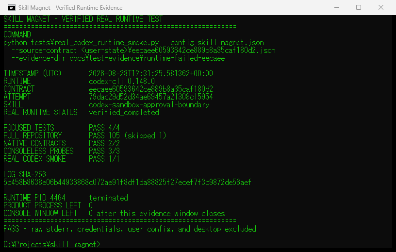

# runtime_failed eecaee fix report

## 変更

- `src/skill_magnet/activation.py`
  - strict JSON Schemaの`result.required`を全declared propertyと一致させた。
  - `saved_paths` / `changes`は変更なしの場合も空配列を返すprompt契約にした。
  - verification sessionを保存しない`--ephemeral`を追加した。
  - runtime非0をexit code、allow-list failure class、固定summary、stderr/stdout SHA-256で保存する。raw本文は保存しない。
- `tests/test_activation.py`
  - 全object propertyがrequiredである回帰testを追加。
  - `invalid_json_schema`、exit code、secret非保持をnegative evidence testへ追加。
  - process限定MCP override、`--ephemeral`、`CREATE_NO_WINDOW`をargv testで固定。
- `tests/real_codex_runtime_smoke.py`
  - 元contractを消費し直さず、同じactual request相当をCodex 0.148.0へ渡す明示的real-runtime smokeを追加。
  - raw stderrは製品所有tempだけで扱い、終了時削除する。

## 保持した安全契約

- `verified_completed`以外を成功に変換しない。
- actual-request SHA-256、selected skill ID、completion status、skill acceptanceをすべて維持。
- `runtime_failed`、`output_failed`、`acceptance_failed`を混同しない。
- global/user MCP設定は変更せず、3 serverだけをprocess限定でdisable。
- runtimeはread-only、approval never、ephemeral、Windowsでは`CREATE_NO_WINDOW`。

## 実Codex結果

| 項目 | 結果 |
|---|---|
| runtime | `codex-cli 0.148.0` |
| source contract | `eecaee60593642ce889b8a35caf180d2` |
| source attempt | `79dac29d52d34ae69457a21308c15954` |
| skill | `codex-sandbox-approval-boundary` |
| actual request SHA-256 | `bb6954a3390b14c0f3a69d47a9de8c09061dd10f19130645766c50f7aa2c0e86` |
| smoke run | `d43b7b53b8b14f4c80cf13146180a260` |
| status | `verified_completed` |
| runtime PID | 4464、終了済み |
| checked residual | PID 13488 / 7684 / 10040 / 4464すべて消滅、matching product-owned process 0 |

修正でprompt契約文を1行追加したため、成功smokeのprompt SHA-256は旧attemptと異なる。一方、source contract、skill ID、actual request文字列とそのSHA-256は同一である。

## Test結果

- focused schema/runtime/argv/actual-request tests: PASS
- repository full suite: 105 tests PASS、1 skipped
- native C++ contract: PASS
- native Python-host contract: PASS
- consoleless/residual probes: 3 PASS
- real Codex smoke: 1 PASS、`verified_completed`
- `git diff --check`: PASS

詳細commandとhashは`test-evidence/runtime-failed-eecaee/sanitized-test.log`と`evidence-manifest.json`に記録した。sanitized log SHA-256は`5c458b8638e06b44936868c072ae91f8df1da88825f27ecef7f3c9872de56aef`。

## Installed状態

`context-menu-status --platform windows`のreadbackはmodern package registered、両context、`usable_installed_state: true`。native変更はないためpackage更新transactionは実施していない。通常entrypointがrepository sourceを参照する構成であることをstatus/bootstrap readbackで確認する。

## Screenshot

専用terminal windowの矩形だけをcaptureした。desktop全体、他window、raw stderr、secretは含めていない。目視確認済み。PNG SHA-256は`a952ff91356b628916abfad2d93ea77710515952f3a20322864b1acf2ab55d84`で、repository版とユーザー向けcopyが一致する。

- repository: `docs/test-evidence/runtime-failed-eecaee/verified-completed-terminal.png`
- user copy: `C:\Users\HOMEA\Documents\Codex\2026-08-28\skill-magnet-pm\outputs\skill-magnet-verified-completed-2026-08-28.png`
