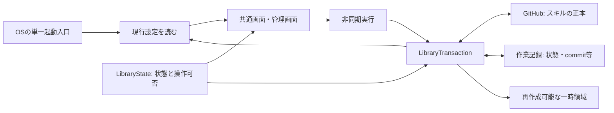

# 「左の状態」― 構造不整合の対応報告

対応日: 2026-09-09。関連: [原因調査報告](cause-investigation-structural-drift-2026-09-09.md)。Beads: `sm-24z`。サブエージェントは使用していない。

**完了:** 構造修正と証明書rollback修正を導入し、全440件は439件成功・1件スキップ、不合格0件。実Explorer試験、リリースゲート、GitHub CIのWindows／macOS両jobが成功した。前回失敗した実MSIXの更新・復旧・アンインストールも成功している。

対象ソース: `9d23e5f2e881e1dbd0531b2f028562a0b58e8b52`。修正ブランチ: `codex/complete-structural-repair`。[現在の集約記録](windows-explorer-leaf-launch-results.md)と[過去の419件の記録](windows-explorer-leaf-launch-results-history-2026-09-09.md)を分離した。

## 修正内容

登録時のpack/skill/commitをWindowsメニューへ固定する実装が、通常更新ではOSを再登録しないという要件と衝突していた。単一入口から共通画面を起動し、その時点の設定で選択肢を構成する経路へ戻した。

| 問題 | 対応 |
|---|---|
| 登録・公開・有効化の旧同期経路が残存 | 呼び出されない内部関数6本を削除し、現行の非同期実行経路とLibraryTransactionに一本化 |
| UIとtransactionで操作可否の判断が分散 | LibraryStateへ状態・送信済みの可能性・破棄可否・再選択要否・表示段階を集約 |
| 有効化途中の作業の扱いが不統一 | commit欄がなくても送信・検証・有効化段階なら破棄を拒否する判定を共有 |
| 固定子メニューと現行設定が不整合 | 単一入口、背景folderのsite解決、起動子processの即時異常終了検出を回復 |
| 要件から外れたテスト | 単一入口の期待値を回復。設定変更前後のOS入口不変と選択肢の更新、実Tk画面の管理・登録ボタン可視性を検証 |
| ラップされたPermissionErrorを設定不正に誤分類 | 原因例外をたどってOS障害を判定。原因解消後に同じ設定で再開するコマンドも保持 |
| ソースと導入物が別の組合せ | 今回のソース一式からwheelを構築し、Pythonとnativeを導入更新 |
| 過去の報告が要件と矛盾 | 管理・登録ボタン撤去を是正とした報告2本の結論を撤回 |
| 旧リリース記録が現在の候補を指している | 旧記録・旧証跡を履歴へ保存し、ソースcommit、wheel hash、最終440件、新しく採取した実機証跡を同じ候補へ更新 |
| 更新rollbackが旧版の署名証明書を削除する | 現在と復旧先の有効なthumbprintを破壊的操作の前に比較。共有証明書は保持し、置換証明書だけ従来の所有権検証付きcleanupへ渡す |

GitHubを唯一の正本とし、一時領域消失時の再作成、未送信編集の消失通知、登録元の再選択、送信済みcommitからの復旧を維持した。利用者の登録元や所有不明のファイルを削除する処理は追加していない。

## 責務の分担

LibraryStateはファイル、Git、Tkを操作しない。画面は判定結果を表示し、送信・検証・反映はLibraryTransactionが行う。今回の整理は二重の実行経路と重複した意思決定の除去であり、大きなモジュールの分割をすべて完了したという主張ではない。

## 検証結果

| 検証 | 結果 |
|---|---|
| 全件試験 | 最終440件、439件成功・1件スキップ、不合格0件（ローカル308.219秒）。GitHub Windows CIでも全件試験成功 |
| 証明書rollbackの回帰 | 修正前に共有証明書の消失を再現。修正後は新規3件と既存関連3件の計6件成功。導入版でも新規3件成功 |
| 導入版の関連試験 | 39件成功に加え、補強した更新・追加・削除の2件も成功。srcを含めない別ディレクトリからsite-packagesを使用 |
| 実Tk画面 | 管理・登録ボタンの表示、一時領域消失後の管理画面起動と未送信編集の通知を確認 |
| 設定更新 | 本文更新・commit更新・pack追加・削除を実Gitの隔離remoteへの公開から有効化まで実行。全段階でOS入口manifest不変、次回configの選択肢更新を確認 |
| 実Explorer | 選択folder・背景の単一入口を物理クリックし、共通GUI→管理画面、登録不足時の案内、同一folderの再投入、別folderの競合、再起動まで成功 |
| 導入DLLのCOM契約 | 同一hashの隔離コピーでfull-invoke成功。単一入口、背景入力、引数、即時非ゼロ終了と証拠記録を検証 |
| OS導入状態 | root_launcher_entry_count=1、menu_leaf_count=0、menu_action_count=1、usable_installed_state=true |
| nativeの照合 | source manifest、artifact hash、DLLのsource binding、build binding、現在設定とのmenu照合がすべてtrue |
| ソース→wheel→導入Python | runtime payloadの同一性を確認 |
| リリースゲート | Windows MVPの全ゲート成功。旧記録を合格にするための検査条件変更は行っていない |
| 証跡のGit取得 | 現在と履歴のbundle/log計4ファイルをGit indexから再取得し、元のbyte列と一致。署名付き証跡の改行変換・自動mergeを禁止 |
| GitHub CI | [run 34328570262](https://github.com/omusubiman5/skill-magnet/actions/runs/34328570262)、候補 `502b893`（上記source `9d23e5f`）でWindows／macOS両job成功。実MSIX lifecycleも成功 |

初回試験ではOS障害分類の修正により復旧コマンドの案内が落ち、既存2件が不合格となった。期待値を弱めず案内を修正し、対象2件と診断7件の再試験が成功した。また実画面テストのEscape終了がフォーカスに依存して全件試験を停止させたため、テストの終了操作をWM_DELETE_WINDOWへ変更した。ボタン表示・復旧内容の検査は保持している。途中終了した実行は全件成功に数えていない。

途中の全件実行では `test_canonical_results_are_consistent` が不合格だった。旧ledgerの419件・旧commit・旧wheel・旧実機証拠を現在の候補に照合していたことが原因である。旧証拠を履歴へ保存したうえで現在候補の実Explorer証拠を再採取し、ledger全体を更新した。同じテストと同じリリースゲートが成功しており、この不一致は解消済み。スキップ1件はdirectory symlink作成に必要なWindows権限がないため（WinError 1314）。

続く初回CIでは、全件試験とrelease gateの後に実行するWindows lifecycleが、更新rollback時の証明書消失を検出した。`_restore_windows_context_backup`が現在版の証明書を無条件でcleanupしてから旧版を再登録していたため、同じ証明書を共有する通常更新でも復旧不能になっていた。検証済みbackupと現在状態のthumbprintが同じ場合は証明書を保持する。異なる証明書のcleanupと、不正な状態を変更前に拒否する検査は維持した。修正に伴ってwheel・導入版・ソースcommit・実Explorer証跡も再更新した。

実Explorer試験ではWindows検索パネルが前面に残り、検証用windowの前面化を拒否する状態も観測した。前面processを識別して検索パネルを閉じた後、全経路が成功した。テストは前面化を要求した直後の戻り値だけで判断せず、入力queueの接続解除後に実際の前面windowを最大500ms確認するようにした。

## 配布・導入の証拠

成果物: `outputs/structural-repair-20260909/`。

このディレクトリは初回修正の記録。証明書修正を含む最終配布物は下記 `rollback-repair/` を使用する。

- `before.zip`、`before-manifest.json`、`before.diff`: 修正前の入力。
- `candidate-source.zip`、`candidate-receipt.json`: 配布ソースとhash照合。
- `skill_magnet-0.5.9-py3-none-any.whl`: 今回導入した配布物。
- `python-install.log`、`native-install.log`、`installed-after-status.json`: 導入結果。
- `installed-tests.log`: 導入版39件の結果。
- `installed-native-contract.log`、`installed-native-contract.json`: 導入DLLの隔離COM試験。
- `full-tests-first-attempt.log`、`full-tests-focus-hang.log`: 初回失敗と停止の記録。
- `full-tests-complete.log`: 旧ledger不一致を検出した途中結果。

最終検証は `outputs/completion-20260909/` に保存した。

- `full-tests.log`: 最終437件、失敗0件。
- `pack-update-contract.log` / `installed-update-contract.log`: 補強した2件のソース版・導入版検証。
- `explorer-final-field.json` / `explorer-final-invoke.log` / `explorer-final-run.log`: ソースcommitに対応する署名付き実Explorer証拠。
- `release-gate.log`: Windows MVP全ゲート成功。
- `evidence-checkout.json`: Git取得後の証跡4ファイルのbyte一致。
- `ledger-update.json`: 更新後の集約値。

証明書修正を含む最終候補の証拠:

- `rollback-repair/candidate-receipt.json` / `candidate-source.zip` / `skill_magnet-0.5.9-py3-none-any.whl`: 最終ソースと配布物。
- `rollback-repair/python-install.log` / `native-install.log` / `installed-status.json`: 最終導入結果。
- `certificate-rollback-before.log` / `certificate-rollback-after.log`: 修正前の再現と関連6件の成功。
- `installed-certificate-rollback.log`: 導入版3件の成功。
- `rollback-final-field.json` / `rollback-final-invoke.log` / `rollback-final-run.log`: 最終ソースに対応する実Explorer証跡。
- `rollback-release-gate.log`: 最終候補のWindows MVPゲート成功。
- `ci-first-failure.log`: 初回CIで発見した証明書rollback失敗の記録。
- `rollback-full-tests.log`: 証明書修正後の全440件成功（1件スキップ）。
- `ci-final.json` / `ci-final.log`: 最終CIの両job成功と実MSIX lifecycle成功。

## 判定の範囲

今回のWindowsローカル署名版について、実装・導入・単一入口からの実操作・更新反映・復旧・現在候補との証跡一致を検証した。追加の受入確認が残っていた `sm-2ao.1`、`sm-2ao.2`、`sm-2ao.3` は解消した。

証跡不一致の `sm-2ao.7` と、CIで追加検出した証明書rollbackの `sm-2ao.9` も、最終候補のCI成功まで確認して解消した。CI確定後の本報告書への結果追記は、検証済みのソース・テスト・配布物を変更していない。

判定範囲はWindows MVP。macOSの実機UI、外部publisherによる公開配布、起動したAIタスクの回答完成は、この受入認定の対象外とする。
